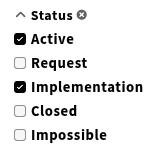

# CheckboxFilterAccordion

A checkbox filter group for search panes: renders an [Accordion](https://github.com/folio-org/stripes-components/tree/main/lib/Accordion) together with a [CheckboxFilter](https://github.com/folio-org/stripes-smart-components/tree/main/lib/SearchAndSort/components/CheckboxFilter) and wires both to the `activeFilters` and `filterHandlers` of `SearchAndSortQuery`. The accordion shows a clear button as soon as the group has an active filter.



## Usage

```js
import { CheckboxFilterAccordion } from '@folio/stripes-leipzig-components';

<CheckboxFilterAccordion />

```


## Props
Name | type | description | default | required
--- | --- | --- | --- | ---
`activeFilters` | object | All active filters of the search pane, keyed by filter group. | `{}` | false
`dataOptions` | array | The options of this filter group, each `{ label, value }`. | `[]` | false
`filterHandlers` | object | The filter handlers of `SearchAndSortQuery`; `clearGroup` and `state` are used. | - | true
`filterKey` | string | Name of the filter group, e.g. `status`. Also builds the accordion id `filter-accordion-${filterKey}`. | - | true
`label` | node | Label of the accordion, already translated. | - | true

All further props are passed on to the underlying `Accordion`, e.g. `closedByDefault`.


## CheckboxFilterAccordion example

```
  const statusOptions = [
    { value: 'active', label: <FormattedMessage id="ui-my-module.filter.status.active" /> },
    { value: 'inactive', label: <FormattedMessage id="ui-my-module.filter.status.inactive" /> },
  ];

  const typeOptions = [
    { value: 'journal', label: <FormattedMessage id="ui-my-module.filter.type.journal" /> },
    { value: 'book', label: <FormattedMessage id="ui-my-module.filter.type.book" /> },
  ];

  <SearchAndSortQuery {...}>
    {({ activeFilters, getFilterHandlers }) => (
      <AccordionSet>
        <CheckboxFilterAccordion
          activeFilters={activeFilters.state}
          dataOptions={statusOptions}
          filterHandlers={getFilterHandlers()}
          filterKey="status"
          label={<FormattedMessage id="ui-my-module.filter.status" />}
        />
        <CheckboxFilterAccordion
          activeFilters={activeFilters.state}
          closedByDefault
          dataOptions={typeOptions}
          filterHandlers={getFilterHandlers()}
          filterKey="type"
          label={<FormattedMessage id="ui-my-module.filter.type" />}
        />
      </AccordionSet>
    )}
  </SearchAndSortQuery>

```

## TypeScript

The component ships type declarations in `CheckboxFilterAccordion.d.ts`, so it can be used from TypeScript modules without further setup.

```ts
import {
  CheckboxFilterAccordion,
  CheckboxFilterAccordionProps,
} from '@folio/stripes-leipzig-components';
```

The value type of the filter (`string` by default) is inferred from `activeFilters` and `filterHandlers`; pass it explicitly for numeric filter values, e.g. `<CheckboxFilterAccordion<number> ... />`.
When the filters live in their own component, `activeFilters` and `filterHandlers` are usually passed down as props that are already unwrapped.
