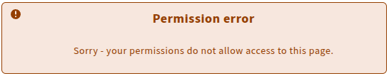

# NoPermissionMessage

Displays a `MessageBanner` when the user is missing required permissions to access a page or feature.
It shows the `stripes-smart-components.permissionError` translation as a headline and `stripes-smart-components.permissionsDoNotAllowAccess` as a paragraph.



## Usage

```js
import { NoPermissionMessage } from '@folio/stripes-leipzig-components';

if (!hasPerms) return <NoPermissionMessage />;
```

## Props

Name | type | description | default | options | required
--- | --- | --- | --- | --- | ---
`className` | string | Adds a custom class name for the `MessageBanner` | Centers the banner horizontally with limited width | - | false
`message` | node | The text shown in the paragraph. Accepts a string or a React node (e.g. `<FormattedMessage />`). | `<FormattedMessage id="stripes-smart-components.permissionsDoNotAllowAccess" />` | - | false
`type` | string | Sets the style of the `MessageBanner` | `warning` | `default`, `error`, `success`, `warning` | false

## Example

```js
if (!hasPerms) return (
  <NoPermissionMessage
    className={css.customStyling}
    message="You do not have the necessary permissions to view this page. Please contact your system administrator."
    type="default"
  />
);
```
