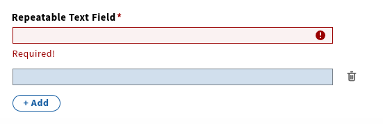

# RepeatableTextField

A helper component for rendering repeatable ([TextField](https://github.com/folio-org/stripes-components/tree/main/lib/TextField)) components using react-final-form-arrays.
The first input can be marked required and custom validation function can be defined.
Since RepeatableTextField uses `Field` from `react-final-form` and `useFieldArray` from `react-final-form-arrays` it only can be used within a final form. It is not compatible with redux form.




## Props

Name | type | description | default | required
--- | --- | --- | --- | ---
`ariaLabel` | string | Aria-label applied to each input field | - | false
`fieldValidate` | func | Custom validation function applied to each field | () => {} | false
`isFirstFieldRequired` | boolean | Marks first field required and undeletable. Note: this does not create an initial field automatically. Set initialValues to [""] if you need an initial required field.  | false | false
`name` | string | name prop to define the field array in the form state. | - | true
`placeholder` | string | Placeholder text for each input | '' | false


## RepeatableTextField example

```js
import { RepeatableTextField } from '@folio/stripes-leipzig-components';

const ValidateUrl = value => {
  const urlRegex = /(https?:\/\/(?:www\.|(?!www))[a-zA-Z0-9][a-zA-Z0-9-]+[a-zA-Z0-9]\.[^\s]{2,}|https?:\/\/(?:www\.|(?!www))[a-zA-Z0-9]+\.[^\s]{2,})/;

  if (!value || urlRegex.test(value)) return undefined;
  return 'Valid url with http:// or https:// required!';
};

<RepeatableTextField
  ariaLabel="Repeatable field"
  fieldValidate={ValidateUrl}
  isFirstFieldRequired
  name="repeatableTextField"
  placeholder={intl.formatMessage({ id: 'ui-app.placeholder.repeatableTextField' })}
/>
```